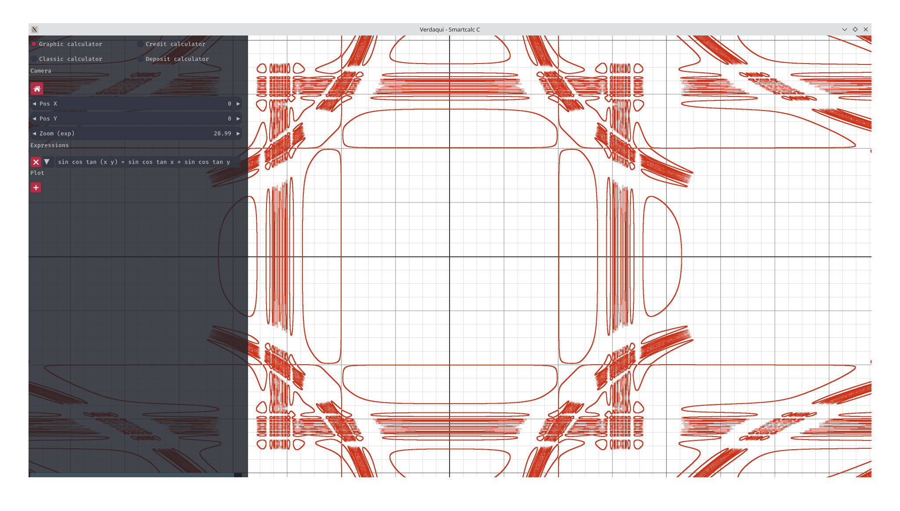
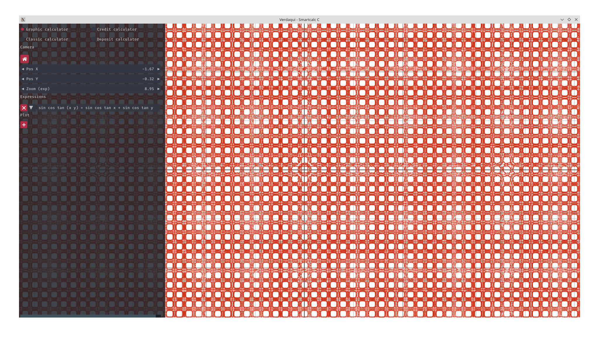
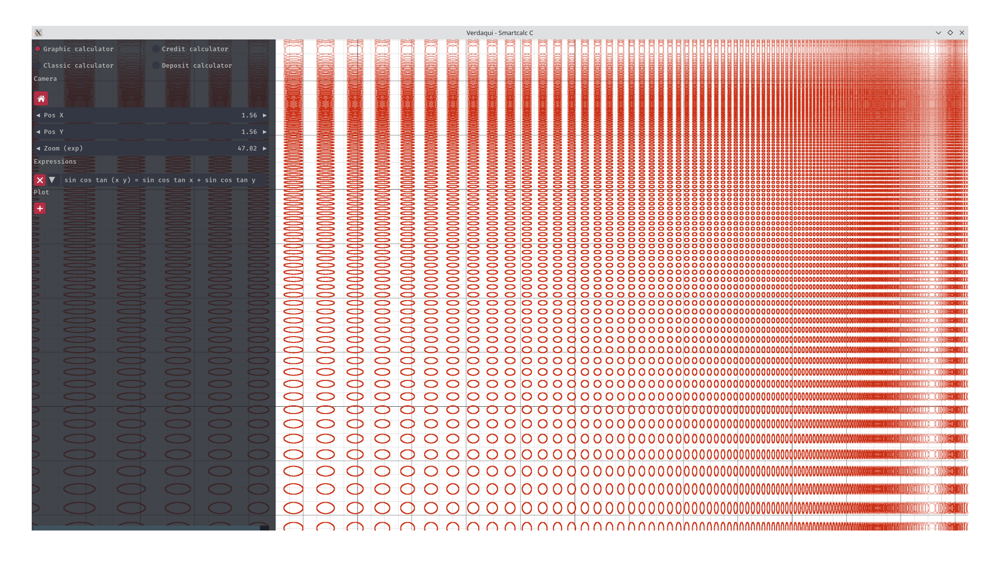

# SmartCalc v1.0

So, that is a graphing calculator in pure C + OpenGL + Nuklear (immediate-mode ui library).

## Features

- Cross platform! MacOS, Windows and Linux support out-of-the-box.
- Custom implemented graph renderer with smooth camera control with just OpenGL. NO GRAPHING LIBRARY IS USED.
- Fully implemented mathematical expressions parser. Full documentation on calculator capabilities is here: [docs/index.md](docs/index.md)
- Pure C, no templates bloat of C++, no JS bullshit, no python slowness.
- FAST. Maybe even blazingly so.
- Supports function definitions, like this:
```
f(x) = sin x
y = f(x) + f(y)
```
- Supports arbitrarily complex functions, like, for example: `y = (x = 1) + 2 / 3 % 4 + y`. (Yes, just `0.5` is a valid expression, `y=y` also is, and `sin(x) = sin(y)` also)

- Also features credit and deposit calculators, btw.

## Screenshorts

Graph of expression `sin cos tan (x * y) = sin cos tan x + sin cos tan y`:


A bit far away:


Zoomed into top right corner of a cell:


## How to run (and build from source

To run:
```bash
$ cd src
src$ make
```

```bash
$ cd src
src$ make build
```

## Full documentation HERE ----> [docs/index.md](docs/index.md)

# Original task


## Part 1. Implementation of SmartCalc v1.0

The SmartCalc v1.0 program must be implemented:

- The program must be developed in C language of C11 standard using gcc compiler. You can use any additional QT libraries and modules
- The program code must be located in the src folder
- The program must be built with Makefile which contains standard set of targets for GNU-programs: all, install, uninstall, clean, dvi, dist, test, gcov_report. Installation directory could be arbitrary, except the building one
- The program must be developed according to the principles of structured programming
- When writing code it is necessary to follow the Google style
- Prepare full coverage of modules related to calculating expressions with unit-tests using the Check library
- GUI implementation, based on any GUI library with API for C89/C99/C11 
<br/>For Linux: GTK+, CEF, Qt
<br/>For Mac: GTK+, Nuklear, raygui, microui, libagar, libui, IUP, LCUI, CEF, Qt
- Both integers and real numbers with a dot can be input into the program. You can optionally provide the input of numbers in exponential notation
- The calculation must be done after you complete entering the calculating expression and press the `=` symbol.
- Calculating arbitrary bracketed arithmetic expressions in infix notation
- Calculate arbitrary bracketed arithmetic expressions in infix notation with substitution of the value of the variable _x_ as a number
- Plotting a graph of a function given by an expression in infix notation with the variable _x_ (with coordinate axes, mark of the used scale and an adaptive grid)
    - It is not necessary to provide the user with the ability to change the scale
- Domain and codomain of a function are limited to at least numbers from -1000000 to 1000000
    - To plot a graph of a function it is necessary to additionally specify the displayed domain and codomain
- Verifiable accuracy of the fractional part is at least to 7 decimal places
- Users must be able to enter up to 255 characters
- Bracketed arithmetic expressions in infix notation must support the following arithmetic operations and mathematical functions:
    - **Arithmetic operators**:

      | Operator name | Infix notation <br /> (Classic) | Prefix notation <br /> (Polish notation) |  Postfix notation <br /> (Reverse Polish notation) |
      | --------- | ------ | ------ | ------ |
      | Brackets | (a + b) | (+ a b) | a b + |
      | Addition | a + b | + a b | a b + |
      | Subtraction | a - b | - a b | a b - |
      | Multiplication | a * b | * a b | a b * |
      | Division | a / b | / a b | a b \ |
      | Power | a ^ b | ^ a b | a b ^ |
      | Modulus | a mod b | mod a b | a b mod |
      | Unary plus | +a | +a | a+ |
      | Unary minus | -a | -a | a- |

      >Note that the multiplication operator contains the obligatory sign `*`. Processing an expression with the omitted `*` sign is optional and is left to the developer's decision

    - **Functions**:
  
      | Function description | Function |
      | ------ | ------ |
      | Computes cosine | cos(x) |
      | Computes sine | sin(x) |
      | Computes tangent | tan(x) |
      | Computes arc cosine | acos(x) |
      | Computes arc sine | asin(x) |
      | Computes arc tangent | atan(x) |
      | Computes square root | sqrt(x) |
      | Computes natural logarithm | ln(x) |
      | Computes common logarithm | log(x) |


## Part 2. Bonus. Credit calculator

Provide a special mode "credit calculator" (you can take banki.ru and calcus.ru as an example):
- Input: total credit amount, term, interest rate, type (annuity, differentiated)
- Output: monthly payment, overpayment on credit, total payment


## Part 3. Bonus. Deposit calculator

Provide a special mode "deposit profitability calculator" (you can take banki.ru and calcus.ru as an example):
- Input: deposit amount, deposit term, interest rate, tax rate, periodicity of payments, capitalization of interest, replenishments list, partial withdrawals list
- Output: accrued interest, tax amount, deposit amount by the end of the term


💡 [Tap here](https://forms.yandex.ru/cloud/6418155a6938722388a12878/) **to leave your feedback on the project**. Pedago Team really tries to make your educational experience better.
